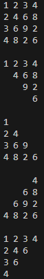

# nested-loop-exercise

##Directions:

1. Clone this repository through GitHub Desktop
   
    1.1. Click "Current repository" in the top left corner of the Github Desktop application
   
    1.2. Click "Add" > "Clone repository..."
   
    1.3. Choose URL
   
    1.4. Enter the following URL: https://github.com/LukeWalter/nested-loop-exercise
   
    1.5. Choose a local path to store the cloned repository
   
    1.6. Press "Clone"

   
   
3. Open the 'nested-loop-exercise' folder in Visual Studio Code
   
    2.1. Go to '__main__.py'

5. Download the TODO Tree VS Code extension
   
    3.1. Press Cmd-Shift-X to open the Extensions window
   
    3.2. Search TODO Tree in the search bar
   
    3.3. Click "Install"

   

7. Complete the TODOs in '__main__.py'

##Solution Output:

